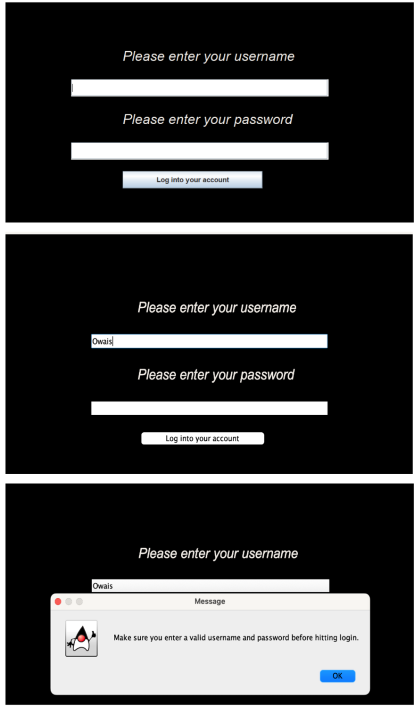
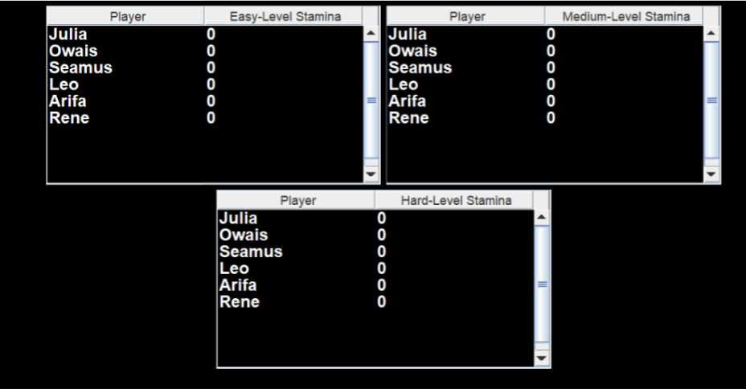
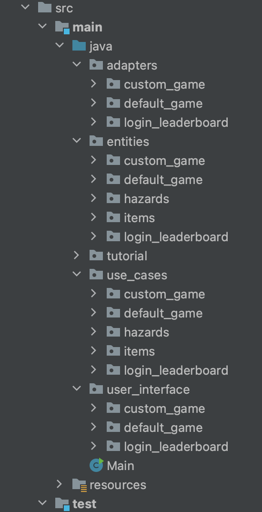
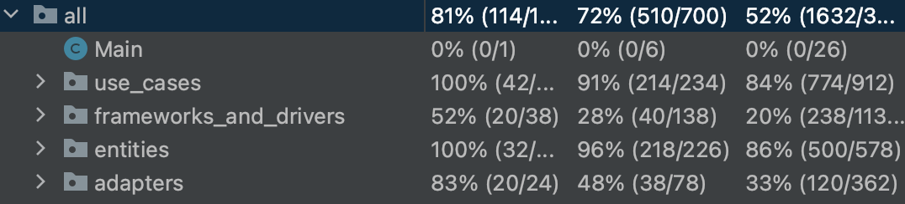
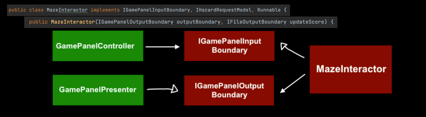
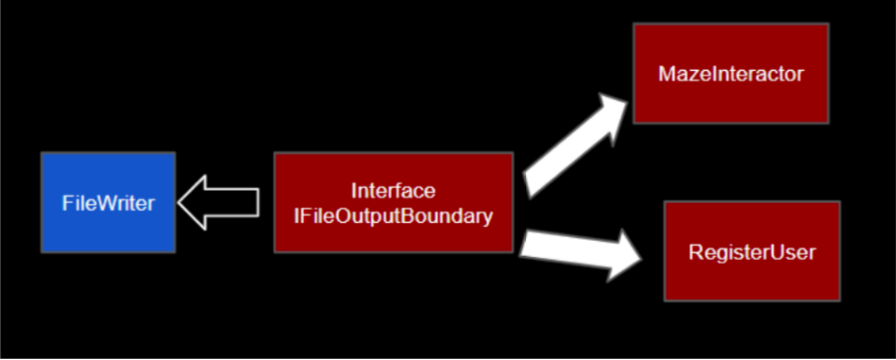
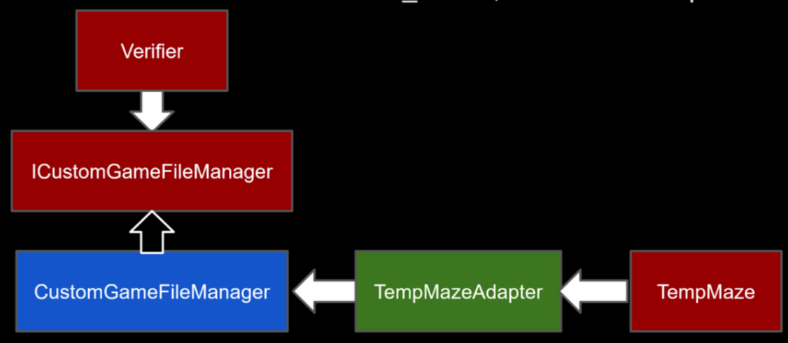

# While this is my fork of the project, all other contributors can be viewed by visiting the original repository.
# Functionality
## Default Game - AstroMaze
You are an astronaut who got lost while studying blackhole physics in a distant solar system. Your spaceship is gone. Oxygen is running low. Floating space rocks block your path. There’s no one else around, and yet you feel an ominous presence… Wait, is that an escape pod? Maybe you can use that to pass the event horizon of the blackhole. Fingers crossed, maybe there’s another universe on the other side…

- Easy / Medium / Hard levels available as default.
- Press W/A/S/D to move around. 
- Get on the Escape Pod and go through the Blackhole before you run out of Oxygen!

## Maze customization
- Main panel - List of stored custom mazes option to play one or make a new one from the list
- Initializer - choose a unique name for your maze
- Editor - build your maze
  - Left click to place an obstacle or empty a tile	
  - Right click to cycle through secondary assets (oxygen tank, key (space pod), enemies, goal (black hole)

## Login and Registration
- Users are able to Register (if they are new) or Log in and can ONLY enter the main game menu if and only if they make a successful login attempt.
- All other edge cases are handled as shown in the demonstration. 
- Minor features: Email RegEx to make sure entered email is correct in the Register User use case, as well as a PasswordStrengthChecker class that makes sure a user enters a sufficiently strong password on registration.
Edge cases such as Users being unable to register or login when leaving one/all fields blank are also covered as shown below:

Such cases, among others can be freely tested by cloning/forking the repo and launching the game on your local machine :D.

## Leaderboards
- A user is able to view the leaderboards after they login or register
- The three leaderboards display the top 10 scores from each level
- Each user's top scores are stored in a data.csv file
- The user score is updated if a user creates a personal highscore. All the scores are then compared to generate the top 10 scores.
- Updated leaderboards are generated every time a user clicks on the leaderboard button.

# Code Organization
- Organized by features & clean architecture layers

# Testing
- Updated test coverage

- GamePanelController and GamePanelPresenter in the adapters layer heavily rely on user input and graphics, so we were not able to test everything.
- UI testing leads to HeadlessExceptions on GitHub. We opted not to test UI, because it involves creating and interacting with windows.

# Code Style and Documentation
- Javadocs for classes & methods
- Reformat code to have consistent code style

# Use of GitHub Features
- Require at least one approval to be merged to main
- PR must pass GitHub Autograding to me merged
- Tried to have incremental PRs  

# Design Patterns
- Observer
  - IGlobalFrameOutputBoundary, GlobalFrame and PanelManager and Panel classes.
  - EditorTile
- Façade
  - combine MazeEnemies and MazeObstacles into a single class “MazeHazards”
- Simple factory
  - CustomAssetSetter uses its method setAssets() to create multiple entities based on the input .txt file

# Clean Architecture
- Use of interfaces for dependency inversion
- No instance of inner layers dependent on outer ones. (i.e. a class in the Use Case layer being dependent on one in the adapters layer.)

# Data Persistence 
- Login, Leaderboard, and Register
  - All users' information, username, email, password, and the scores from the levels are stored in data.csv
  - FileReader and FileWriter are implemented in the UI to update and read the data
  - IFileInputBoundary and IFileOutputBondary interfaces allow the use cases to call on the update/read methods through dependency inversion.

- Custom mazes
  - Stored in text files under custom_mazes, each with a unique name ensured by the verifier 
  - Retrieved by the file manager and sent to PlayCustom > IPlayCustom > MazeInteractor (default game runner)

# SOLID
- Single Responsibility: each class / interface has one responsibility 
- Open / Closed: leave room for extension (e.g. Façade design pattern to let the entities deal with specific implementation - allows new types of Items & Hazards to be added!)
- Liskov Substitution: subclasses only extend the parent class, not modify it
- Interface Segregation: all interfaces are small (a few methods max)
- Dependency Inversion: use of interfaces to follow (“no outward dependency” and “no-more-than-one-layer-deep” rules of Clean Architecture)

# Possible Improvements
Login / Leaderboard
- Email authentication as well as password hashing could be added to the project to increase user security. Right now, the project sports a modular structure thanks to Clean Architecture principles to make these use cases possible. Email authentication can also be used if a user forgot their password, as we currently have not implemented this bonus feature but it is very much possible to do so following the prior two additions.

Customization 
- Editing custom mazes that have already been stored
- Additional colours & images for assets 
- Customization of size 

Others
- Adding a go back to home screen option from the game screen
- Changing the implementation of the redrawMaze method in GamePanelPresenter so that it does not rely on MazeInteractor

# So what are you waiting for? Clone the repo and run Main!
